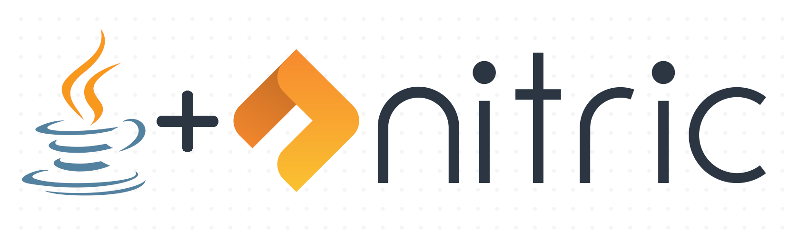

<p align="center">
  
</p>

# Nitric Java SDK
The Java SDK supports the use of the cloud-portable [Nitric](https://nitric.io) framework with Java 11.
> The SDK is in early stage development and APIs and interfaces are still subject to breaking changes

## Prerequisites
- OpenJDK 11+

## Getting Started

### Using the [Nitric CLI](https://github.com/nitric-tech/cli)

```bash
nitric make:project example
 ? Include an example service? function/java11
 ? Name for the example service? hello-world
 ✔ Making Project getting-started
 ✔ Making Service hello-world
```

### Adding to an existing project
**Maven**
```xml
<dependency>
    <groupId>io.nitric</groupId>
    <artifactId>java-sdk</artifactId>
    <version>0.5.0</version>
</dependency>
```

## Javadoc
[](https://javadoc.io/doc/io.nitric/java-sdk)