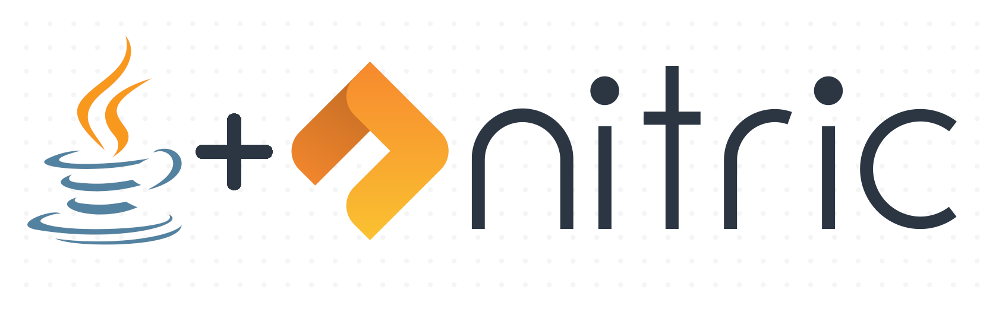

<p align="center">
  
</p>

# Nitric Java SDK
The Java SDK supports the use of the cloud-portable [Nitric](https://nitric.io) framework with Java 11.
> The SDK is in early stage development and APIs and interfaces are still subject to breaking changes

## Prerequisites
- OpenJDK 11+

## Getting Started

### Using the [Nitric CLI](https://github.com/nitric-tech/cli)
> @nitric/sdk is included in all node related SDK projects by default

```bash
nitric make:function <java-template> example
```

Some available Java templates are:

* faas/java11

### Adding to an existing project
**Maven**
```xml
<dependency>
    <groupId>io.nitric</groupId>
    <artifactId>java-sdk</artifactId>
    <version>1.0.0</version>
</dependency>
```

## Usage
Javadoc and Code examples are available [here](https://nitrictech.github.io/java-sdk/)